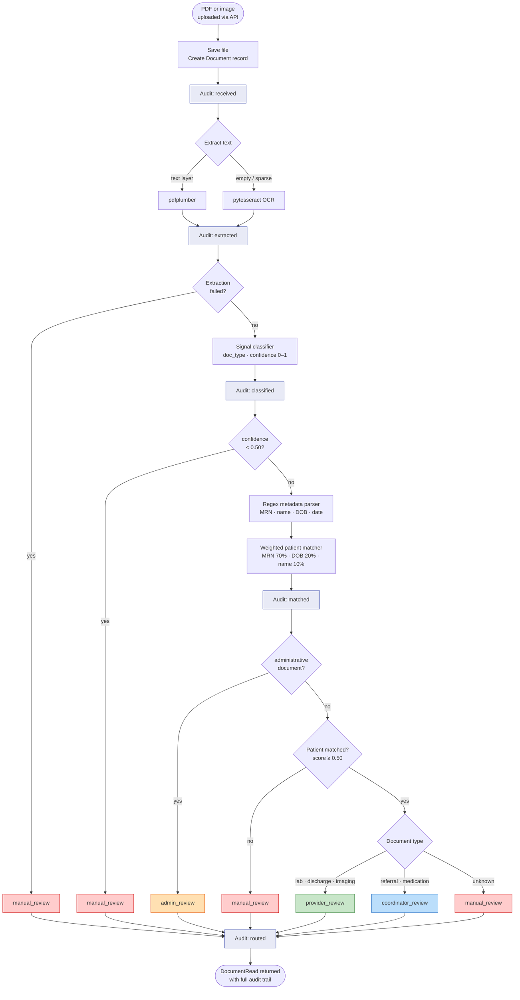

# Clinical Document Intake & Routing Pipeline

A backend service for automated clinical document intake, text extraction, classification, patient matching, and routing. Documents are submitted through an HTTP API, processed through a rules-based pipeline, and assigned to workflow queues. Low-confidence results are held for manual review rather than forced through automation.

This project focuses on **application-layer design**: classification logic, patient identity resolution, audit trails, and domain modeling — built as a self-contained FastAPI service rather than a composition of cloud-managed services. For a serverless AWS approach to the same problem domain, see [intelligent-document-routing-pipeline](https://github.com/KyleRemick/intelligent-document-routing-pipeline).

## Requirements

- Python 3.11+
- [Tesseract OCR](https://github.com/tesseract-ocr/tesseract) (required for image-based documents)

Or run with Docker, which handles Tesseract automatically.

## Quick Start

### Local

```bash
pip install -e ".[dev]"
cp .env.example .env
python scripts/seed_db.py
uvicorn app.main:app --reload
```

Interactive API docs: `http://localhost:8000/docs`

### Docker

```bash
docker-compose up --build
# In a separate terminal, seed the database:
docker-compose exec api python scripts/seed_db.py
```

## Configuration

| Variable | Default | Description |
|---|---|---|
| `DATABASE_URL` | `sqlite:///./clinical_intake.db` | SQLAlchemy connection string |
| `UPLOAD_DIR` | `./uploads` | Directory for stored document files |
| `MIN_TEXT_CHARS` | `50` | Character count below which OCR fallback is triggered |
| `LOW_CONFIDENCE_THRESHOLD` | `0.5` | Classification score below which documents enter manual review |

## API

| Method | Path | Description |
|---|---|---|
| `POST` | `/documents/upload` | Upload a document; triggers the full pipeline |
| `GET` | `/documents` | List documents (filter by `status`, `queue`, `doc_type`) |
| `GET` | `/documents/{id}` | Document detail with full audit trail |
| `PATCH` | `/documents/{id}/correct` | Submit a manual correction |
| `GET` | `/review/queue` | Documents awaiting manual review, oldest first |
| `GET` | `/review/queue/{name}` | Documents in a specific named queue |
| `GET` | `/patients` | List synthetic patient records |
| `GET` | `/patients/{id}` | Patient detail |
| `GET` | `/health` | Service health check |

## Pipeline

```
Upload → Extract → Classify → Parse Metadata → Match Patient → Route → Audit
```

1. **Extract** — text pulled from the PDF text layer; pytesseract OCR fallback when the layer is absent or sparse
2. **Classify** — signal-based rules engine assigns a document type and a confidence score (0–1)
3. **Parse metadata** — regex patterns extract patient identifiers (MRN, name, DOB, document date, facility)
4. **Match** — extracted identifiers scored against synthetic patient records using weighted fields
5. **Route** — document assigned to a workflow queue based on type and match confidence
6. **Audit** — each stage appends a timestamped event record to the document's audit trail



## Confidence Scoring

### Classification

Each document type has a set of named signals (regex patterns with weights). Confidence is the fraction of total possible signal weight that fired. Scores below `LOW_CONFIDENCE_THRESHOLD` route to `manual_review` regardless of document type.

### Patient Matching

Candidate patients are scored across four fields:

| Field | Weight |
|---|---|
| MRN (exact) | 0.70 |
| Date of birth | 0.20 |
| Last name | 0.07 |
| First name | 0.03 |

A score ≥ 0.50 is required for a confident match. MRN alone clears this threshold; name and DOB alone do not.

## Document Types and Routing

| Document type | Default queue |
|---|---|
| Lab result | `provider_review` |
| Referral | `coordinator_review` |
| Discharge summary | `provider_review` |
| Imaging report | `provider_review` |
| Medication update | `coordinator_review` |
| Administrative / advance directive | `admin_review` |
| Unknown type, low confidence, or no patient match | `manual_review` |

## Project Structure

```
app/
├── main.py              # FastAPI app, lifespan, router registration
├── config.py            # Settings via pydantic-settings / env vars
├── database.py          # SQLAlchemy engine and session factory
├── models/
│   ├── document.py      # Document, AuditEvent ORM models and status enums
│   └── patient.py       # Patient ORM model
├── schemas/
│   ├── document.py      # Pydantic request/response types for documents
│   └── patient.py       # Pydantic types for patients
├── routers/
│   ├── documents.py     # Upload, list, detail, correction endpoints
│   ├── patients.py      # Patient lookup endpoints
│   └── review.py        # Manual and named queue endpoints
├── services/
│   ├── extraction.py    # PDF text extraction with OCR fallback
│   ├── classification.py# Signal-based document type classifier
│   ├── metadata_parser.py# Regex extraction of patient identifiers
│   ├── patient_matcher.py# Weighted scoring against patient records
│   ├── router.py        # Queue assignment rules
│   └── audit.py         # Audit event writer
└── utils/
    └── confidence.py    # Confidence score helpers
data/
└── seed_patients.json   # 20 synthetic patient records
migrations/              # Alembic schema migrations
sample_docs/             # Synthetic PDFs for local testing
scripts/
├── seed_db.py           # Populates the database from seed_patients.json
└── create_sample_docs.py# Generates sample PDFs using fpdf2
tests/                   # 159-test pytest suite covering all layers
```

## Running Tests

```bash
pytest
```

Tests use an isolated SQLite database that is created and torn down per test. The suite covers unit tests for each service module, integration tests across the full HTTP API, and end-to-end routing scenarios.

## Database Migrations

```bash
# Apply all migrations
alembic upgrade head

# Generate a new migration after model changes
alembic revision --autogenerate -m "describe the change"

# Roll back one step
alembic downgrade -1
```

## Future Enhancements

The current implementation is intentionally scoped to a clean, demonstrable MVP. A production deployment would extend it in these directions:

| Enhancement | Description |
|---|---|
| LLM-assisted extraction | Structured prompts against extracted text for higher-accuracy metadata parsing, especially on non-standard document formats |
| ML classification | A trained classifier to replace or augment the rules engine, with active learning from manual correction feedback |
| Async pipeline | Background task queue (Celery or FastAPI `BackgroundTasks`) to process uploads non-blocking and support burst traffic |
| Authentication & RBAC | Reviewer vs. admin roles; API key or OAuth2 for service-to-service calls |
| Postgres + pgvector | Production-scale relational store; pgvector enables semantic duplicate detection |
| FHIR-compatible records | Patient and document resources aligned to FHIR R4 for EHR integration |
| Ingest adapters | Fax-to-PDF, SFTP drop, and email attachment ingestion alongside the current HTTP upload |
| Observability | OpenTelemetry traces and structured logging; per-stage latency and confidence score metrics |
| Duplicate detection | Document fingerprinting to catch re-submissions before they enter the pipeline |
| Frontend review UI | Browser-based review queue with inline correction, filters, and audit log display |

## Design Notes

- **Rules-first classification** keeps decisions explainable and auditable without requiring a trained model. Signal names are logged with every classification, making it straightforward to trace why a document received a given type or confidence score.
- **Human review for uncertainty** — documents below the confidence threshold, or with no patient match, are queued for manual review rather than silently auto-routed. Reviewers can correct any field and the correction is recorded in the audit trail.
- **Modular services** — extraction, classification, matching, and routing are separate modules with no cross-dependencies. An LLM-based metadata extractor or a trained classifier can be dropped in later without restructuring the pipeline.
- **Synthetic data only** — no real patient records are used anywhere in this project.
- **Single-process, synchronous pipeline** — suitable for local development and portfolio demonstration. A background task queue (e.g. Celery, FastAPI `BackgroundTasks`) can be introduced independently.
